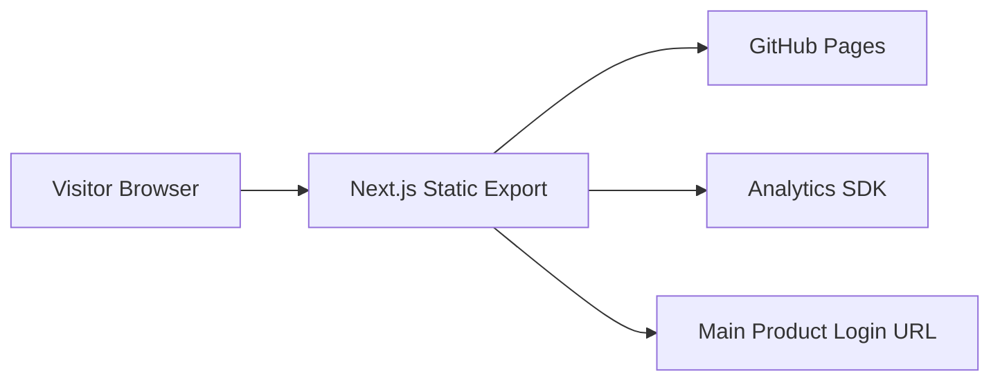
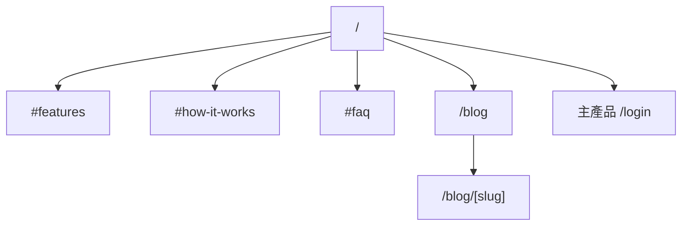

# Landing Page 工程手冊（Engineer Handbook v1）

## 0. 文件資訊
- 專案：Wardrobe Landing（獨立 GitHub repo）
- 版本：v1.0
- 日期：2026-02-17
- 用途：提供接手工程師單一入口文件，直接完成開發、部署、驗收與交接

## 1. 快速導讀
### 1.1 你先看這 3 份就能開始開發
1. 本文件：`LandingPage-Engineer-Handbook-v1.md`
2. 設計規格：`LandingPage-Design-Spec-v1.md`
3. 文案稿：`LandingPage-CopyDeck-v1.md`

### 1.2 你要交付的最小成果
1. `/` Landing 頁可上線
2. `/blog` 與 `/blog/[slug]` 可靜態輸出
3. GitHub Pages 自動部署成功
4. CTA 能導回主產品登入頁

## 2. 專案目標與邊界
### 2.1 目標
- 先完成宣傳型 landing page
- 架構預留產品部落格擴充
- 採 GitHub Pages 靜態部署（無伺服器 runtime）

### 2.2 In Scope
- Landing 區塊（Hero、Feature、How it works、FAQ、Final CTA）
- Blog 列表與文章頁（靜態）
- SEO/OG、sitemap、robots
- 基本追蹤事件（CTA、blog click）

### 2.3 Out of Scope
- Supabase/Auth/API/資料庫
- 主產品內功能（登入後衣櫃管理）
- CMS 後台（首版不做）

### 2.4 與主產品整合規則
- Landing 只做導流，不做登入邏輯
- 所有導流連結由 env 控制：
  - `NEXT_PUBLIC_APP_LOGIN_URL`
  - `NEXT_PUBLIC_APP_SIGNUP_URL`（可選）
- 禁止在多個元件硬編 production 網址

## 3. 技術架構
### 3.1 建議技術棧
- Next.js 16（App Router）
- TypeScript
- CSS Modules + design tokens
- MDX（blog 內容）
- GitHub Actions + GitHub Pages

### 3.2 架構圖


### 3.3 GitHub Pages 必守限制
- 必須使用 `output: 'export'`
- 不可依賴 SSR/ISR/Middleware/Server Actions
- `next/image` 需 `images.unoptimized = true`
- Project site（`username.github.io/repo`）需設定 `basePath` + `assetPrefix`

## 4. 資訊架構與路由
### 4.1 Sitemap


### 4.2 路由責任
| Route | 目的 | 型態 |
|---|---|---|
| `/` | 產品價值與導流 | 靜態 |
| `/blog` | 內容入口 | 靜態 |
| `/blog/[slug]` | 內容詳頁 | 靜態 |
| `/404` | 兜底頁 | 靜態 |

### 4.3 URL 命名規範
- 全小寫
- 使用 `-` 連接
- 優先英文 slug（SEO 與維運一致）

## 5. Repo 結構（建議）
```text
wardrobe-landing/
  app/
    layout.tsx
    page.tsx
    blog/
      page.tsx
      [slug]/
        page.tsx
  components/
    landing/
    blog/
    shared/
  content/
    blog/
      *.mdx
  lib/
    site-config.ts
    blog.ts
    analytics.ts
  public/
    images/
    og/
  styles/
    tokens.css
  next.config.ts
  package.json
  .github/
    workflows/
      deploy.yml
```

## 6. 本機建置流程
### 6.1 初始化
```bash
npx create-next-app@latest wardrobe-landing --ts --eslint --app --src-dir=false
cd wardrobe-landing
npm i gray-matter
npm i -D @types/mdx
```

### 6.2 `next.config.ts`
直接用範本：`templates/next.config.ts.example`

### 6.3 環境變數（僅前端公開）
```bash
NEXT_PUBLIC_APP_LOGIN_URL=https://app.example.com/login
NEXT_PUBLIC_APP_SIGNUP_URL=https://app.example.com/login
NEXT_PUBLIC_SITE_URL=https://username.github.io/wardrobe-landing
NEXT_PUBLIC_GA_ID=
```

## 7. GitHub Pages 部署流程
### 7.1 Workflow
直接用範本：`templates/deploy-github-pages.yml.example`

### 7.2 GitHub 設定
1. Repo `Settings` -> `Pages`
2. Source 選 `GitHub Actions`
3. push 到 `main` 觸發部署

### 7.3 本機部署前驗證
```bash
npm run lint
npm run build
npx serve out
```

### 7.4 常見錯誤
- 樣式/JS 404：`basePath` 或 `assetPrefix` 設錯
- 圖片不顯示：忘記 `images.unoptimized = true`
- 刷新子頁 404：該頁未靜態產生（slug 沒被 build 收錄）

## 8. 開發任務拆分（可直接開 issue）
1. `feat/bootstrap-static-export`
2. `feat/landing-sections`
3. `feat/blog-list-page`
4. `feat/blog-post-page`
5. `feat/seo-og-sitemap-robots`
6. `feat/analytics-events`
7. `chore/github-pages-workflow`
8. `docs/repo-readme-and-runbook`

## 9. 里程碑（建議）
- M0（0.5d）：Bootstrap + deploy baseline
- M1（1~2d）：Landing 頁完成
- M2（1~2d）：Blog 架構完成
- M3（0.5~1d）：SEO + Analytics
- M4（0.5d）：QA + 發布

## 10. 驗收與 DoD（單一清單）
### 10.1 功能完成
- [ ] `/`、`/blog`、`/blog/[slug]` 可用
- [ ] Landing 區塊完整（Hero/Feature/How/FAQ/CTA）
- [ ] CTA 正確導向主產品 login

### 10.2 工程品質
- [ ] `npm run lint` 通過
- [ ] `npm run build` 通過且輸出 `out/`
- [ ] 無 SSR 依賴（符合 static export）

### 10.3 SEO 與追蹤
- [ ] 每頁 metadata 正確
- [ ] `sitemap.xml`、`robots.txt` 存在
- [ ] 事件 `landing_view`、`landing_click_primary_cta`、`landing_click_blog_preview` 可觸發

### 10.4 響應式與體驗
- [ ] 390x844、768x1024、1440x900 版面正常
- [ ] 主要互動可鍵盤操作
- [ ] 主要對比可讀

### 10.5 部署
- [ ] GitHub Actions workflow 成功
- [ ] GitHub Pages URL 正常開啟

## 11. 交接輸出物
1. GitHub repo URL
2. 上線網址（Pages URL / custom domain）
3. 環境變數清單
4. 最新成功 workflow run 連結
5. 已知限制與後續 backlog

## 12. 參考文件
- 設計規格：`LandingPage-Design-Spec-v1.md`
- 文案稿：`LandingPage-CopyDeck-v1.md`
- `next.config` 範本：`templates/next.config.ts.example`
- deploy workflow 範本：`templates/deploy-github-pages.yml.example`
